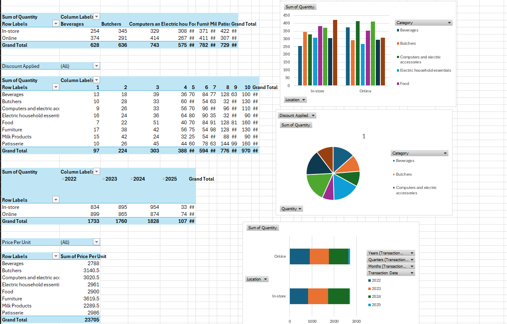

# Retail-Stores-Sales-EDA

## Description

An exploratory data analysis project meant to clean and analyze performance of various retail stores.  

## License

This project is licensed under the MIT License - see the LICENSE.md file for details

## Data Source

The dataset was sourced from [@Ahmed Mohamed](https://www.kaggle.com/ahmedmohamed2003). 
The dataset is under a [CC BY-SA 4.0](https://creativecommons.org/licenses/by-sa/4.0/) license. 